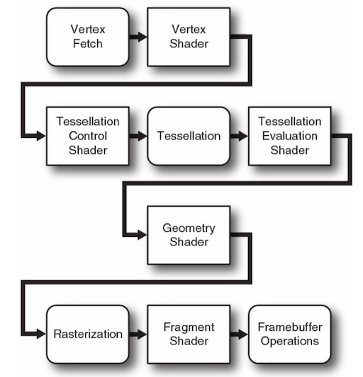

# OpenGLSuperbible 读书笔记

## 渲染管线概要图


顶点拾取 => 顶点着色器 => 
细分曲面着色器 => 细分曲面 =>  细分曲面评价着色器 => 
几何着色器 =>
光栅化 => 片段着色器 =>  帧缓冲区操作

## 第一个OpenGL程序

```cpp
#include <sb7.h>
class simpleclear_app : public sb7::application
{
    virtual void render(double currentTime)
    {
        static const GLfloat red[] = { 1.0f, 0.0f, 0.0f, 1.0f };
        glClearBufferfv(GL_COLOR, 0, red);
    }
};

DECLARE_MAIN(simpleclear_app)

```

### 使用着色器
OpenGL的着色器有 顶点着色器, 细分曲面着色器, 几何图形着色器 和 计算着色器
最简单的着色器只有一个顶点着色器，但是要想看到他的颜色还必须要一个片段着色器

```cpp
void glClearBufferfv(
    GLenum buffer,          // Specify the buffer to clear.
    GLint drawBuffer,       // Specify a particular draw buffer to clear.
    const GLfloat * value); // RGBA
```

vertex shader
```cpp
// 我们只使用 4.5 OpenGL core profile 的功能
# version 450 core
void main(void)
{
    // gl_Position vertex的位置
    gl_Position = vec4(0.0, 0.0, 0.5, 1.0);
}
```

fragment shader
```cpp
# version 450 core
out vec4 color; void main(void)
{
    color = vec4(0.0, 0.8, 1.0, 1.0);
}
```

### 编译着色器

```cpp

// shaderType:  GL_COMPUTE_SHADER, GL_VERTEX_SHADER, GL_TESS_CONTROL_SHADER, GL_TESS_EVALUATION_SHADER, GL_GEOMETRY_SHADER, or GL_FRAGMENT_SHADER.
// 创建一个shader对象
GLuint glCreateShader(GLenum shaderType);

// shader : glCreateShader 返回的句柄
// count : string 数组的size
// string : string数组
// length : string 的长度, 如果为NULL, 要求string以NULL结尾
// 取代shader对象里的代码
void glShaderSource(	GLuint shader,
                        GLsizei count,
                        const GLchar **string,
                        const GLint *length);

// shader : glCreateShader 返回的句柄
void glCompileShader(	GLuint shader);

// 创建空的program, shader可以attach
GLuint glCreateProgram(	void);

// program : glCreateProgram 返回的句柄
// shader : glCreateShader 返回的句柄
// 附加shader对象到program对象上
void glAttachShader(	GLuint program,
                        GLuint shader);

// 链接program对象
void glLinkProgram(	GLuint program);

// 删除program对象
void glDeleteProgram(	GLuint program);
```

### Vertex Array Object (VAO) 顶点数组对象

```cpp

// n : 数组的大小
// arrays : 要绑定的句柄的指针
void glCreateVertexArrays(	GLsizei n,
                            GLuint *arrays);


// array : 绑定的句柄
void glBindVertexArray(	GLuint array);

```

