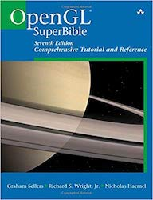

# OpenGLSuperbible 读书笔记

  

[购买链接](https://www.amazon.cn/dp/0672337479/ref=sr_1_2?ie=UTF8&qid=1544971390&sr=8-2&keywords=opengl+superbible)

## 渲染管线概要图


顶点拾取 => 顶点着色器 => 
细分曲面着色器 => 细分曲面 =>  细分曲面评价着色器 => 
几何着色器 =>
光栅化 => 片段着色器 =>  帧缓冲区操作

## 第一个OpenGL程序

```cpp
#include <sb7.h>
class simpleclear_app : public sb7::application
{
    virtual void render(double currentTime)
    {
        static const GLfloat red[] = { 1.0f, 0.0f, 0.0f, 1.0f };
        glClearBufferfv(GL_COLOR, 0, red);
    }
};

DECLARE_MAIN(simpleclear_app)

```

### 使用着色器
OpenGL的着色器有 顶点着色器, 细分曲面着色器, 几何图形着色器 和 计算着色器
最简单的着色器只有一个顶点着色器，但是要想看到他的颜色还必须要一个片段着色器

```cpp
void glClearBufferfv(
    GLenum buffer,          // Specify the buffer to clear.
    GLint drawBuffer,       // Specify a particular draw buffer to clear.
    const GLfloat * value); // RGBA
```

vertex shader
```cpp
// 我们只使用 4.5 OpenGL core profile 的功能
# version 450 core
void main(void)
{
    // gl_Position vertex的位置
    gl_Position = vec4(0.0, 0.0, 0.5, 1.0);
}
```

fragment shader
```cpp
# version 450 core
out vec4 color; void main(void)
{
    color = vec4(0.0, 0.8, 1.0, 1.0);
}
```

### 编译着色器

```cpp

// shaderType:  GL_COMPUTE_SHADER, GL_VERTEX_SHADER, GL_TESS_CONTROL_SHADER, GL_TESS_EVALUATION_SHADER, GL_GEOMETRY_SHADER, or GL_FRAGMENT_SHADER.
// 创建一个shader对象
GLuint glCreateShader(GLenum shaderType);

// shader : glCreateShader 返回的句柄
// count : string 数组的size
// string : string数组
// length : string 的长度, 如果为NULL, 要求string以NULL结尾
// 取代shader对象里的代码
void glShaderSource(	GLuint shader,
                        GLsizei count,
                        const GLchar **string,
                        const GLint *length);

// shader : glCreateShader 返回的句柄
void glCompileShader(	GLuint shader);

// 创建空的program, shader可以attach
GLuint glCreateProgram(	void);

// program : glCreateProgram 返回的句柄
// shader : glCreateShader 返回的句柄
// 附加shader对象到program对象上
void glAttachShader(	GLuint program,
                        GLuint shader);

// 链接program对象
void glLinkProgram(	GLuint program);

// 删除program对象
void glDeleteProgram(	GLuint program);

// 删除shader对象
void glDeleteShader(	GLuint shader);


// 渲染阶段使用 program 对象
void glUseProgram(	GLuint program);

```

### Vertex Array Object (VAO) 顶点数组对象

```cpp

// n : 数组的大小
// arrays : 要绑定的句柄的指针
void glCreateVertexArrays(	GLsizei n,
                            GLuint *arrays);

// array : 绑定的句柄
void glBindVertexArray(	GLuint array);


// 和glCreateVertexArrays应该一致的
void glDeleteVertexArrays(	GLsizei n,
                            const GLuint *arrays);

```

### 绘画命令`glDrawArrays`

```cpp
// 给 OpenGL 管线输送顶点数据
// mode : 图元类型 GL_POINTS, GL_LINE_STRIP, GL_LINE_LOOP, GL_LINES, GL_LINE_STRIP_ADJACENCY, GL_LINES_ADJACENCY, GL_TRIANGLE_STRIP, GL_TRIANGLE_FAN, GL_TRIANGLES, GL_TRIANGLE_STRIP_ADJACENCY, GL_TRIANGLES_ADJACENCY and GL_PATCHES
// first : 开始的索引
// count : 渲染的个数
void glDrawArrays(	GLenum mode,
                    GLint first,
                    GLsizei count);


// 设置点的大小, 默认是1
// size : 光栅的直径
void glPointSize(	GLfloat size);
```

### 绘画三角形
```cpp
# version 450 core

void main()
{
    const vectices[3] = vec4[3](
        vec4(0.25, -0.25, 0.5, 1.0f),
        vec4(-0.25, -0.25, 0.5, 1.0f),
        vec4(0.25, 0.25, 0.5, 1.0f),
    );

    gl_Position = vertices[gl_VertexID];
}

glDrawArrays(GL_TRIANGLES, 0, 3);

```

## 跟着渲染管线走


顶点拾取 ->


### 传递数据给顶点着色器
顶点着色器是OpenGL渲染管线第一个可编程阶段，可编程阶段和其他强制阶段是有区别的
在顶点着色器运行之前，一个可修改函数阶段叫做 vertex fetching 有时候也叫 vertex pulling，他们自动提供了顶点着色器的输入

#### 顶点属性(vertex attribute)
在GLSL中，着色器输入输出数据是通过`in`和`out`限定符存储的

```
layout (location = 0) in vec4 offset
```
glVertexAttrib*() 更新 vertex attribute 输入到顶点染色器

```cpp
// index 对应location
// v 参数
void glVertexAttrib4fv(	GLuint index,
 	                    const GLfloat *v);
```
```cpp

GLfloat attrib[] = { 
    (float) sin(currentTime) * 0.5f,
    (float) cos(currentTime) * 0.6f,
    0.0f,
    0.0f };

glVertexAttrib4fv(0, attrb);
```

### shader之前传递数据
用out关键字创建输出变量，会被送到下一个阶段用in关键字声明同名字的变量

#### interface block(接口块？？)

匹配interface block是通过block名字匹配的，但是允许block实例在不同的阶段拥有不同的名字有两个目的
一是避免疑惑的变量命名，二是可能在不同的阶段从单项变长数组
```cpp

layout (location 0) in vec4 color;

out VS_OUT{
    vec4 color;
} vs_out;


void main()
{
    vs_out.color = color;
}

```

```cpp

in VS_OUT{
    vec4 color;
} fs_in;

void main()
{
    color = fs_in.color;
}

```


